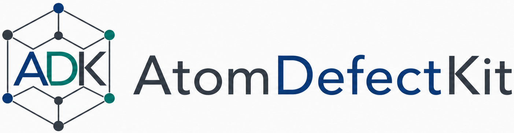

## AtomDefectKit



`AtomDefectKit` is a Python package for atomistic defect simulations and analysis, with the current workflows focused on BCC metals, screw dislocations, and related defect physics.

Current migrated components:

- basic PACE-backed property and point-defect calculations
- model loading through a registry-based `models/` package
- screw dislocation setup and DD-map workflows
- NEB-based Peierls barrier workflow
- PACE training-log analysis and benchmark plotting
- stacking-fault and traction-separation curve containers

### Package layout

```text
AtomDefectKit/

```

### Model registration note

The registry-based model-loading pattern used in `src/atomdefectkit/models/`
and `atomdefectkit.load_model()` follows the same general idea used in
[MoltenSaltCalc](https://github.com/leiapple/MoltenSaltCalc/tree/main), where
individual model modules register themselves and are then exposed through a
shared loader interface.

### PACE calculator note

The atomistic PACE calculator used for BCC potentials is available through the optional `pace` dependency group. It is installed from the upstream `ICAMS/python-ace` repository instead of the unrelated package that is published on PyPI as `pyace`.

### Managing model environments with uv

This project uses `uv` for Python and dependency management. The package is tested on Python 3.11, 3.12, and 3.13. If the system Python is not suitable, let `uv` install and pin Python:

```bash
uv python install 3.11
uv python pin 3.11
```

The core package and most model backends are tested on Python 3.11-3.13. The
optional `pace` extra currently depends on `pyace`, which should be treated as
Python 3.11 only until its upstream packaging catches up.

Install the base environment with:

```bash
uv sync
```

Once the package is published to PyPI, the equivalent base install will be:

```bash
pip install atomdefectkit
```

Each MLIP backend is exposed as an optional dependency extra. These extras are intentionally marked as mutually exclusive because the upstream model stacks often require incompatible versions of NumPy, PyTorch, TensorFlow, JAX, or CUDA helper packages. Sync one model backend at a time:

```bash
uv sync --extra fairchem
uv run --extra fairchem python scripts/run_tests_fairchem.py

uv sync --extra mace
uv run --extra mace python scripts/run_tests_mace.py

uv sync --extra 7net
uv run --extra 7net python scripts/run_tests_7net.py

uv sync --extra upet
uv run --extra upet python scripts/run_tests_upet.py

uv sync --extra grace
uv run --extra grace python scripts/run_tests_grace.py

uv sync --extra eqv3
uv run --extra eqv3 python scripts/run_test_eqv3_adsorption.py --model-name eqV3-omat24-gradient
```

Once published to PyPI, install one backend extra in a fresh environment:

```bash
pip install "atomdefectkit[fairchem]"
pip install "atomdefectkit[mace]"
pip install "atomdefectkit[upet]"
```

For PACE-backed workflows, sync the PACE extra:

```bash
uv sync --extra pace
uv run --extra pace python scripts/run_tests_pace.py
```

If you run `uv` from outside the repository, `--extra` has no effect unless you point `uv` at this project. Use `--project` with the path to the cloned repository:

```bash
uv sync --project /path/to/AtomDefectKit --extra upet
uv run --project /path/to/AtomDefectKit --extra upet python /path/to/AtomDefectKit/scripts/run_tests_upet.py
uv run --project /path/to/AtomDefectKit --extra upet python /path/to/AtomDefectKit/scripts/run_tests_upet_bcc_elements.py
```

If you do not want to run inside the repository checkout, create a clean working
directory elsewhere and install directly from GitHub into a dedicated virtual
environment. This is a good fit for HPC scratch space such as
`/scratch-shared/$USER`:

```bash
mkdir -p /scratch-shared/$USER/atomdefectkit-upet
cd /scratch-shared/$USER/atomdefectkit-upet

uv python install 3.11
uv venv --python 3.11
source .venv/bin/activate

export UV_CACHE_DIR=/scratch-shared/$USER/uv-cache
export HF_HOME=/scratch-shared/$USER/huggingface
export TORCH_HOME=/scratch-shared/$USER/torch
export MPLCONFIGDIR=/scratch-shared/$USER/matplotlib

uv pip install "atomdefectkit[upet] @ git+https://github.com/leiapple/AtomDefectKit.git@main"
```

Use the same pattern for other backends by swapping the extra:

```bash
uv pip install "atomdefectkit[mace] @ git+https://github.com/leiapple/AtomDefectKit.git@main"
uv pip install "atomdefectkit[7net] @ git+https://github.com/leiapple/AtomDefectKit.git@main"
uv pip install "atomdefectkit[fairchem] @ git+https://github.com/leiapple/AtomDefectKit.git@main"
uv pip install "atomdefectkit[grace] @ git+https://github.com/leiapple/AtomDefectKit.git@main"
uv pip install "atomdefectkit[eqv3] @ git+https://github.com/leiapple/AtomDefectKit.git@main"
```

The `pace` backend should stay on Python 3.11:

```bash
uv pip install "atomdefectkit[pace] @ git+https://github.com/leiapple/AtomDefectKit.git@main"
```

The `eqv3` extra is aligned with the upstream Equiformer v3 environment guide
from Atomic Architects and should currently be treated as Python 3.11 only,
with
`torch==2.7.1`, `torchvision==0.22.1`, `torchaudio==2.7.1`,
`ase==3.25.0`, `e3nn==0.5.6`, `lmdb==1.7.3`, `numba==0.61.2`,
`numpy==2.2.6`, `orjson==3.11.1`, `pandas==2.3.1`,
`pymatgen==2025.6.14`, `pyyaml==6.0.2`, `scipy==1.16.1`,
`submitit==1.5.3`, `tensorboard==2.20.0`, `timm==0.4.12`,
`torch-geometric`, `tqdm==4.67.1`, `wandb==0.21.0`, and the
`fairchem-core` package from the Atomic Architects `equiformer_v3`
repository. It is not packaged for Windows in this project.

For the closest match to the upstream EqV3 evaluation environment, install the
supplemental pinned requirements in this repository after syncing the extra:

```bash
uv sync --extra eqv3
uv pip install -r requirements/eqv3.txt
```

The lower-level PyG companion wheels such as `pyg_lib`, `torch-scatter`,
`torch-sparse`, `torch-cluster`, and `torch-spline-conv` still need the
upstream wheel-index installation commands when your platform requires them.
On CUDA systems, use the matching PyTorch and PyG wheel commands recommended by
the upstream EqV3 project when your cluster requires a specific CUDA build:

```bash
uv pip install torch==2.7.1 torchvision==0.22.1 torchaudio==2.7.1 --index-url https://download.pytorch.org/whl/cu128
uv pip install pyg_lib torch_scatter torch_sparse torch_cluster torch_spline_conv -f https://data.pyg.org/whl/torch-2.7.0+cu128.html
uv pip install torch_geometric
uv pip install "atomdefectkit[eqv3] @ git+https://github.com/leiapple/AtomDefectKit.git@main"
uv pip install -r requirements/eqv3.txt
```

If you want to install EqV3 directly from GitHub on HPC, this is the intended order:

```bash
uv pip install torch==2.7.1 torchvision==0.22.1 torchaudio==2.7.1 --index-url https://download.pytorch.org/whl/cu128
uv pip install pyg_lib torch_scatter torch_sparse torch_cluster torch_spline_conv -f https://data.pyg.org/whl/torch-2.7.0+cu128.html
uv pip install torch_geometric
uv pip install "atomdefectkit[eqv3] @ git+https://github.com/leiapple/AtomDefectKit.git@main"
uv pip install -r requirements/eqv3.txt
```

If you want to keep separate persistent virtual environments for different models, set `UV_PROJECT_ENVIRONMENT` per backend:

```bash
UV_PROJECT_ENVIRONMENT=.venv-fairchem uv sync --extra fairchem
UV_PROJECT_ENVIRONMENT=.venv-fairchem uv run --extra fairchem python scripts/run_tests_fairchem.py

UV_PROJECT_ENVIRONMENT=.venv-mace uv sync --extra mace
UV_PROJECT_ENVIRONMENT=.venv-mace uv run --extra mace python scripts/run_tests_mace.py
```

On HPC systems, it is usually helpful to put caches on scratch storage:

```bash
export UV_CACHE_DIR=$SCRATCH/uv-cache
export HF_HOME=$SCRATCH/huggingface
export TORCH_HOME=$SCRATCH/torch
export MPLCONFIGDIR=$SCRATCH/matplotlib
```

The repository includes a SLURM template for model test workflows:

```bash
# Five-element UPET run: V, Nb, Ta, Mo, W
sbatch --export=ALL,MODEL=upet,RUN_MODE=bcc_elements scripts/slurm_run_model_test.sh

# Single-element MACE run
sbatch --export=ALL,MODEL=mace,RUN_MODE=single,ELEMENT=V,INITIAL_A0=2.997 scripts/slurm_run_model_test.sh
```

Set `PROJECT_DIR=/path/to/AtomDefectKit` in `--export` if you submit the job
from outside the repository.

For the five-element BCC batch scripts, the repository currently includes:

- `scripts/run_tests_upet_bcc_elements.py`
- `scripts/run_tests_7net_bcc_elements.py`
- `scripts/run_tests_fairchem_bcc_elements.py`
- `scripts/run_tests_grace_bcc_elements.py`

These wrappers loop over `V`, `Nb`, `Ta`, `Mo`, and `W` with preset initial
lattice guesses and call the corresponding single-element driver.

Load a model calculator:

```python
import atomdefectkit
from atomdefectkit import BasicProperties

calc = atomdefectkit.load_model(
    "pace",
    {"potential_file": "/path/to/potential.yaml"},
)
workflow = BasicProperties(calculator=calc)
```

Available bundled model loaders currently include:

- `7net`
- `chgnet`
- `fairchem`
- `grace`
- `mace`
- `mattersim`
- `nequip`
- `nequix`
- `eqv3`
- `pace`
- `upet`

Inspect available loaders programmatically:

```python
import atomdefectkit

print(atomdefectkit.available_models())
print(atomdefectkit.available_model_metadata())
```

If you want to add a new backend, the easiest path is to follow the existing
per-model modules in `src/atomdefectkit/models/` and keep the same
registry-based pattern.

The package now bundles the reference DFT JSON files used by
`BasicProperties.plot_comparison()`, so installed workflows can generate
comparison plots even when they are launched from a different working directory
or from outside the source tree.

### Documentation

The repository now includes a basic Read the Docs setup based on the v2
configuration file format:

- Documentation website: [atomdefectkit.readthedocs.io](https://atomdefectkit.readthedocs.io/)
- `.readthedocs.yaml`
- `docs/conf.py`
- `docs/index.rst`
- `docs/getting-started.rst`
- `docs/api.rst`

To build the documentation locally:

```bash
uv run --with sphinx --with sphinx-rtd-theme sphinx-build -b html docs docs/_build/html
```

### Release checklist

Before publishing to PyPI, run the lightweight checks:

```bash
uv lock --check
uv run --group dev pytest
uv build --no-sources
```

Publish releases from a clean tagged commit. PyPI Trusted Publishing through GitHub Actions is preferred; for a manual upload with uv, use:

```bash
uv publish
```

### Notes

This first migration pass keeps the code close to the existing source projects so functionality is preserved while the package structure becomes cleaner. A follow-up cleanup pass should standardize APIs, add tests, and separate reusable library code from workflow scripts more sharply.
