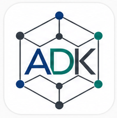

## AtomDefectKit



`AtomDefectKit` is a Python package for atomistic defect simulations and analysis, with the current workflows focused on BCC metals, screw dislocations, and related defect physics.

Current migrated components:

- basic ACE-backed property and point-defect calculations
- model loading through a registry-based `models/` package
- screw dislocation setup and DD-map workflows
- NEB-based Peierls barrier workflow
- PACE training-log analysis and benchmark plotting
- stacking-fault and traction-separation curve containers

### Package layout

```text
AtomDefectKit/

```

### ACE calculator note

The PyPI package named `pyace` is not the atomistic ACE calculator used for BCC potentials here. It currently resolves to an unrelated music-processing package, so it is not installed as a default dependency for this project.

If you want to run ACE-backed workflows, install the correct ACE calculator package separately in this environment and then use the example scripts or future `ace` model loader support in `atomdefectkit`.

Load a model calculator:

```python
import atomdefectkit

calc = atomdefectkit.load_model(
    "ace",
    {"potential_file": "/path/to/potential.yaml"},
)
workflow = atomdefectkit.ACECalculations(calc)
```

Available bundled model loaders currently include:

- `ace`
- `mace`
- `grace`
- `fairchem`

Inspect available loaders programmatically:

```python
import atomdefectkit

print(atomdefectkit.available_models())
print(atomdefectkit.available_model_metadata())
```

### Notes

This first migration pass keeps the code close to the existing source projects so functionality is preserved while the package structure becomes cleaner. A follow-up cleanup pass should standardize APIs, add tests, and separate reusable library code from workflow scripts more sharply.
